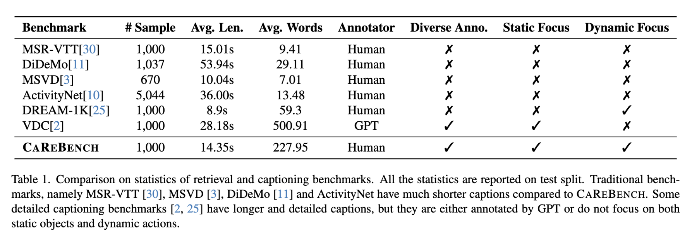
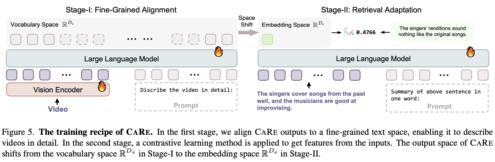
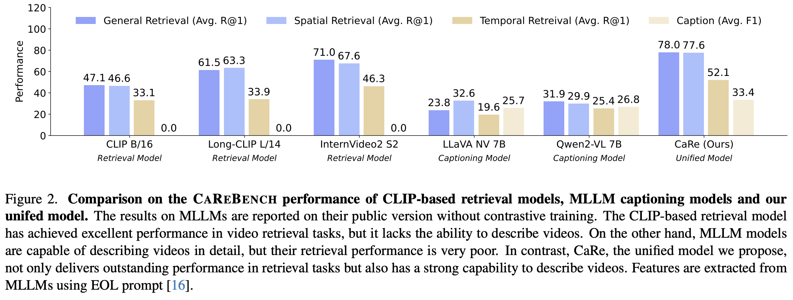

<div align="center">
  <h2>
    
    <a href="https://arxiv.org/pdf/2501.00513" style="vertical-align: middle;"><span style="font-variant: small-caps;">CaReBench:</span> A Fine-grained Benchmark for Video Captioning and Retrieval</a>
  </h2>

  Yifan Xu, [Xinhao Li](https://scholar.google.com/citations?user=evR3uR0AAAAJ), Yichun Yang, Desen Meng, Rui Huang, [Limin Wang](https://scholar.google.com/citations?user=HEuN8PcAAAAJ)

  <p align="center">
    🤗 <a href="https://huggingface.co/MCG-NJU/CaRe-7B">Model</a> &nbsp&nbsp | &nbsp&nbsp 🤗 <a href="https://huggingface.co/datasets/MCG-NJU/CaReBench">Data</a> &nbsp&nbsp｜ &nbsp&nbsp 📑 <a href="https://arxiv.org/pdf/2501.00513">Paper</a> &nbsp&nbsp 
    <br>
  </p>
</div>


## :memo: Introduction

**🌟 CaReBench** is a fine-grained benchmark comprising **1,000 high-quality videos** with detailed human-annotated captions, including **manually separated spatial and temporal descriptions** for independent spatiotemporal bias evaluation.


**📊 ReBias and CapST Metrics** are designed specifically for retrieval and captioning tasks, providing a comprehensive evaluation framework for spatiotemporal understanding in video-language models.


**⚡ CaRe: A Unified Baseline** for fine-grained video retrieval and captioning, achieving competitive performance through **two-stage Supervised Fine-Tuning (SFT)**. CaRe excels in both generating detailed video descriptions and extracting robust video features.


**🚀 State-of-the-art performance** on both detailed video captioning and fine-grained video retrieval. CaRe outperforms CLIP-based retrieval models and popular MLLMs in captioning tasks.



## :partying_face: Get Started

Our code is quite simple and easy. Just follow the instructions below and the code will work like magic.

### Prepare

Install the requirements.

```
pip install -r requirements.txt
```

### Inference

**Our framework supports auto-loadable inference of all the MLLMs metioned in our paper**, including CaRe, LLaVA NeXT Video, MiniCPM-V 2.6, InternVL2, Qwen2-VL and Tarsier. You only need to change the checkpoint path and our model loader will load them automatically.

**For Video Captioning Task**

```python
from utils.video import read_frames_decord
from models.modeling_captioners import AutoCaptioner

captioner = AutoCaptioner.from_pretrained('path/to/checkpoints/CaRe-7B')
frames = read_frames_decord(video_path='assets/demo.mp4', num_frames=32)
description = captioner.describe(frames.unsqueeze(0))
print(description[0])
```

**For Video Retrieval Task**

```python
from utils.video import read_frames_decord
from models.modeling_encoders import AutoEncoder
from torch.nn.functional import cosine_similarity

encoder = AutoEncoder.from_pretrained('path/to/checkpoints/CaRe-7B')
frames = read_frames_decord(video_path='assets/demo.mp4', num_frames=32)
text = "This video features a man slicing tomatoes in the kitchen."
vision_emb = encoder.encode_vision(frames.unsqueeze(0))
text_emb = encoder.encode_text(text)
print(f'Vision embedding shape: {vision_emb.shape}')
print(f'Text embedding shape: {text_emb.shape}')
print(f'Cosine similarity: {cosine_similarity(vision_emb, text_emb)}')

```

### Benchmark

1. Download data from [our huggingface repository](https://huggingface.co/datasets/MCG-NJU/CaReBench).

2. Add our benchmark to `data.config`.

3. Check the arguments in `scripts/captioning.sh` or `scripts/retrieval.sh` and run it. 


### Training

**Stage-I**

We are preparing for the release of Stage-I training code.

**Stage-II**

1. Download data

```
mkdir data && wget https://huggingface.co/datasets/princeton-nlp/datasets-for-simcse/resolve/main/nli_for_simcse.csv -O data/nli_for_simcse.csv
```

2. Check the arguments in `scripts/train.sh` we prepare for you and run it. 


## Customize Your Own Model

Our framework is designed for our paper, but it is also scalable since we have added many code specification. If you wish to have your retrieval model or caption model evaluated within our framework, please refer to the following guidelines.

### Step 1: Add Base Model

1. Inherit your model from the `BaseModel` in `models/modeling_basemodels.py`, and implement the `__init__` function. Your model will automatically gain the from_pretrained method.
2. (Optional) To support all the auto methods, set `ARCHITECTURE` in your class property. Make sure there is `config.json` in your model path with the structure below (something like transformers models). `ARCHITECTURE` should be the same as `architectures[0]`. Then, all the auto methods will load your model according to this architecture.
```json
{
  "architectures": [
    "CLIPModel"
  ],
  ...
}
```
### Step 2: Add Retrieval Model

1. Inherit your retrieval model from your custom base model and `EncodeMixin` in `models/modeling_encoders.py
2. Implement `encode_vision` and `encode_text` method.

### Step 3: Add Caption Model

1. Inherit your caption model from your custom base model and `CaptionMixin` in `models/modeling_captioners.py
2. Implement `describe` method.
